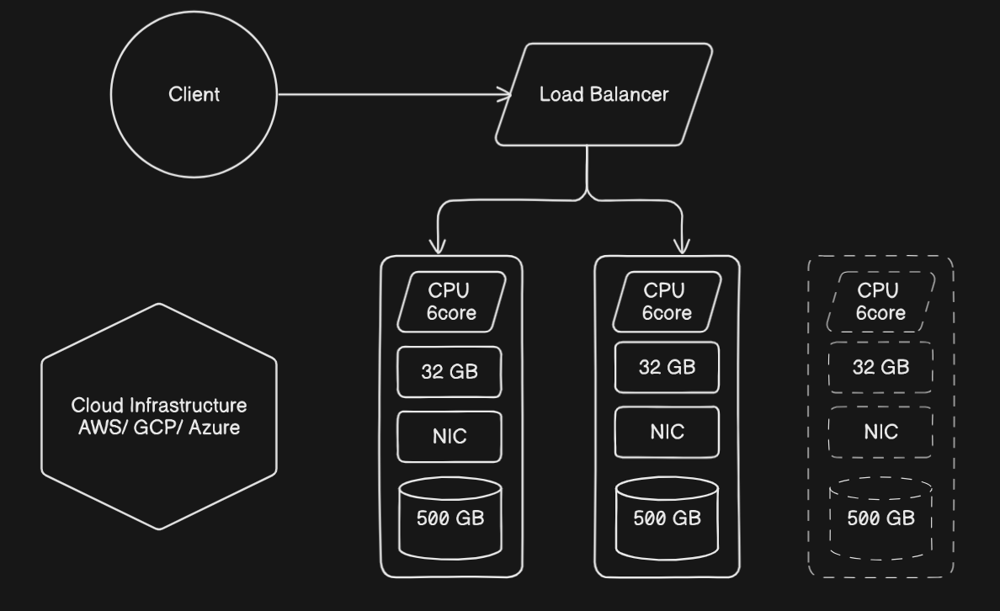

# Microservices Architecture in node.js / rust (rocket.rs)

**Initial Implementation**
-
- Multiple services that communicate through message broker (Apache Kafka / RabbitMQ)
- Nginx to act as reverse proxy for managing request APIs from client
- Docker Images for database, services and reverse proxy to make it easily deployable on cloud

<br/><br/>

**Continuous Deployment Setup**
-
- Set new branch rules
- Setup workflow for Continuous Deployment Setup complete for running all tests
```yml
name: Continuous Integration

on:
pull_request:
branches: [ "main" ]

jobs:
CI_verification:

runs-on: ubuntu-latest

strategy:
matrix:
    node-version: [14.x]

steps:
- uses: actions/checkout@v3
- name: Use Node.js ${{ matrix.node-version }}
uses: actions/setup-node@v3
with:
    node-version: ${{ matrix.node-version }}

- name: Test Customer Service
working-directory: ./customer
run: |
    npm ci
    npm test
```
- Setup workflow for the QA environment for live testing
- Finally setup workflow for the main Production environment with setting up .env files, and the .zip for cloud upload.

<br/>

**For Production Environment**

- Go to AWS for setting up QA env
- Identify Access Management Dashboard
- Users -> Add User
- Set Access Key for Id and Secret Key
- Go to Attach existing policies directly
- Set AdministrationAccess-AWSElasticBeanstalk
- Create User


**Set Elastic Beanstalk Access For GitHub Actions**

- Set Repository Actions Secrets -> AWS_ACCESS_KEY_ID && AWS_SECRET_ACCESS_KEY
- Create Application in ElasticBeanstalk
- Choose Sample Application and Create Application

- Create a new Node.js action workflow in GitHub Actions
- Set env vars and continuous deployment with AWS

- Workflow will upload zip on its own, when a new commit or merge is done.

- Now, setup a new web server environment on Elastic Beanstalk

- **This setup ensures, on each Pull Request we first run all the unit tests and e2e tests**

- **Deploy it on QA environment, for manual testing**

- **Then deploy on command using _workflow-dispatch_ to Production environment.**

<br/><br/>

**RPC Implementation**
-
- Segregate Responsibilities to follow pure CQRS
    - [Learn about Command and Query Responsibility Segregation](https://learn.microsoft.com/en-us/azure/architecture/patterns/cqrs)
- Optimizing services for scalability
- Refactoring codebase and keeping meaningful data close to the services
- Revoke redundant data from services / DB
- Isolate DB instance with special access to perform DBA operations

<br/>

### Refactoring Services to reduce unnecessary connections, references and make them more independent using RPC

- Managing the connections with RPC connections.
- Shifting data endpoints
    - Wishlist and Shopping_Details, from customer service to shopping service.
    - Publishing and sending signals from each service to other to automatically detect, deletion of user to update shopping service and other utilities.
    - Grab product info through RPC from product service to shopping service.
- **This way the shopping service acts as the RPC Request sender and only sends requests for payload to the products service. And the Product service is a RPC Observer that sends payload whenever a request message is received.**
- We can simply reduce the customer model as we no longer need the product and cart and simply can read data from other services using RPC.

<br/><br/>

**Error Handling**
-
- Catch base errors and respond to client with meaningful error code
- Trace / Log Error with suitable tools. example: cloud-watch, Sentry, etc.
- Monitoring & reporting with suitable tools to handle incidents

<br/><br/>

**Testing**
-
- working...

<br/><br/>

**Scaling entire architecture using Node.js Clusters**
-
- Implementing Horizontal Scaling and initiating multiple instances of the services using AWS EC2 :
   <!-- - <br/> -->
   <!--  -->
    - Launch Instance
    - Choose the Amazon Machine Image, and select the OS image
    - Choose Instance type
    - Create Key Pair to securely connect to the instance
    - Choose Security Group (SSH traffic, allows all IP addresses to access the instance)
- Create the Instance and Connect
- Connecting using SSH client :
    - Open an SSH client
    - Locate your private key file. The key for this instance for e.g. ```k8s-access.com```
    - Run this command to ensure the key is not publicly available.
    ```bash 
    chmod 400 k8s-access.pem
    ``` 
    - Connect to the instance using its Public DNS. For e.g. ```ec2-52-58-237-8.eu-central-1.compute.amazonaws.com```
  
- Run this SSH command to connect
```bash
ssh -i "key" "public DNS"
```
<br/>

### Setting up connection to GitHub repo of the service

- Install node and git on the instance

- Now generate SSH key pair to connect it the GitHub repo using :
```bash
ssh-keygen -t rsa -C "email" -b 4096
```

- The private and public key are saved in your instance. Grab the public key using : 
```bash
cat ~/.ssh/id_rsa.pub
```

- Add the public key in Deploy Keys on GitHub. To check if the key can authenticate the GitHub to the ec2 instance, run ```ssh -vT git@github.com```

- If it perfectly connects, clone the git repo onto the ec2 instance.Install all the dependencies and export all .env variables too in the cloned repo and run it. Also, run the scale command to expose multiple pId's of your instance.

- To connect and control traffic directly from the ec2 console and expose a Port to connect; add inbound security rules in the security groups. Create a custom TCP rule with "PORT" value and "Anywhere IPv4" as source to access the URL from anywhere.
  
<br/>

### Making connection secure using NGINX
- Delete previous custom TCP rule and setup a new HTTP and HTTPS rules
- Install Nginx on the ec2 instance and enable it.
```bash
sudo amazon-linux-extras install nginx1 -y

sudo systemctl enable nginx

sudo systemctl start nginx

sudo systemctl status nginx
```

- To reach the application server, edit the nginx config file
```bash
sudo vim /etc/nginx/nginx.config
```

- Setup a proxy pass to the port in the config file in the server block
```yml
location / {
    proxy_pass http://localhost:8001;
}
```

- Check the config file for errors ```sudo nginx -t``` and restart nginx ```sudo systemctl restart nginx```

<br/><br/>

**Setting up workflows to automate this whole process**
-
- Setup a self-hosted workflow for deploying to ec2 on a node.js run environment
- Setup a new self-hosted runner for GitHub Actions
  - Choose Linux
  - And run all the commands in the runner on the ec2 console.
- This creates a service file ```svc.sh```, which needs to be installed and started. 

**This service file is responsible for adding a listener that listens for the actions in the GitHub repo with the help of the Linux runner and it will directly deploy it to the EC2 Instance on AWS**
```bash
sudo ./svc.sh install

sudo ./svc.sh start
```

<br/>
<hr/>
<hr/>
<br/>

**Scaling Microservices using Reverse Proxy**
-
